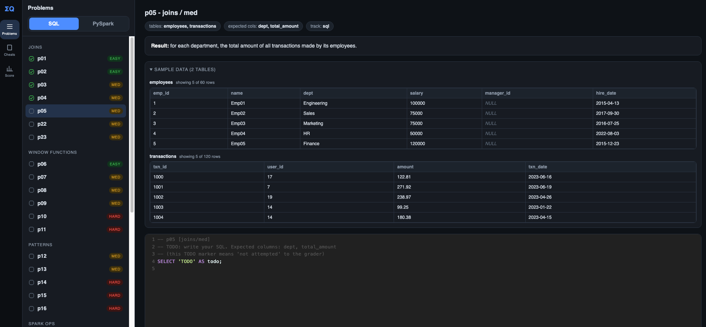

# Whetstone

A practice playground to keep your engineering skills sharp. Pick a problem,
write your answer, and have it graded instantly against a reference. You write
the code, not just read it.

## What it is

Whetstone is meant to grow into one place to practice the things you actually
use on the job: SQL, PySpark, Python, Java, Databricks, Azure, Kubernetes,
Helm, and more. You drill a concept, the harness grades you, you move on.

This is an early, small version. Today it ships SQL (DuckDB) and PySpark (local)
problems plus a few cheat sheets. I'm adding more problems, more topics, and
more features as I go.

It's simple on purpose. I built it to keep myself sharp and figured it might
help others too.

## Screenshot



The browser UI: pick a language, pick a problem, write your answer, run it, and
see pass or fail with a row by row diff.

## Setup

All you need is Python.

1. Clone and enter the repo:
   ```bash
   git clone https://github.com/Nour-eddineAE/whetstone.git
   cd whetstone
   ```
2. Install dependencies:
   ```bash
   pip install -r requirements.txt
   ```
3. Build the practice data:
   ```bash
   python manage.py seed
   ```
4. Run the app and open http://localhost:9000:
   ```bash
   python manage.py web
   ```

That's it.

> PySpark needs a JVM. If a check complains about Java, install a JDK
> (for example `brew install openjdk@17`) and make sure `java -version` works.

## How it works

Problems live in `problems/`. You write answers in `answers/sql/` and
`answers/pyspark/`, then check them in the browser or from the CLI:

```bash
python manage.py check sql p03    # grade one answer
python manage.py hint p03         # one line nudge
python manage.py reveal p03 sql   # reference solution
python manage.py web              # browser UI
```

Same answer files, same grader, whether you use the CLI or the UI.

## Today's coverage

SQL and PySpark, easy to hard: joins, window functions, common patterns, Spark
ops, aggregation, CTEs, date functions, and subqueries. Plus a handful of cheat
sheets you can skim. More topics coming.

## Contributing

Adding a problem or a whole new topic is a few files, no framework surgery.
See [CONTRIBUTING.md](CONTRIBUTING.md).

## License

[MIT](LICENSE).
